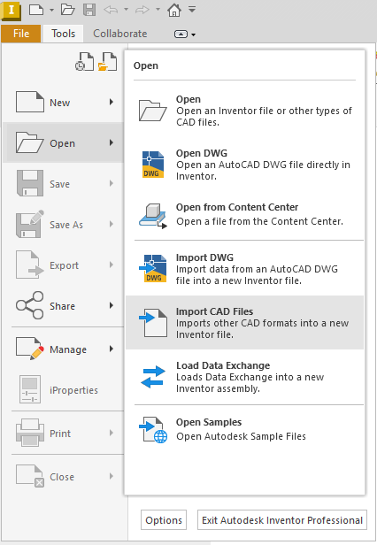
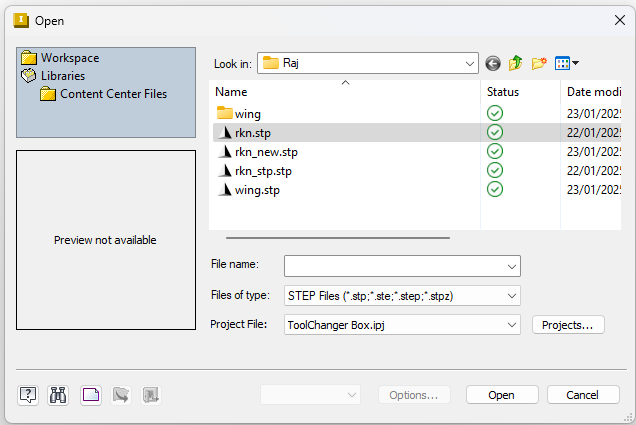
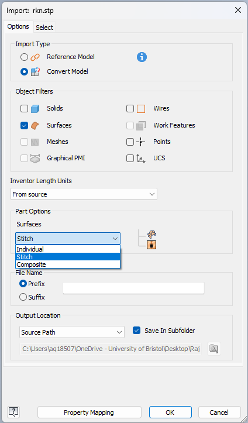
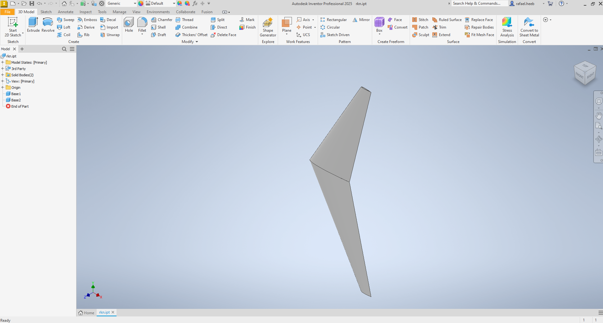
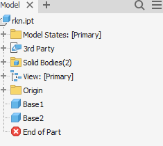
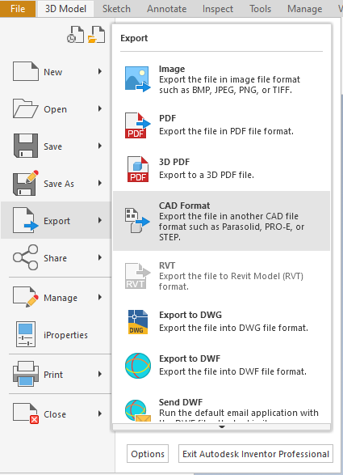
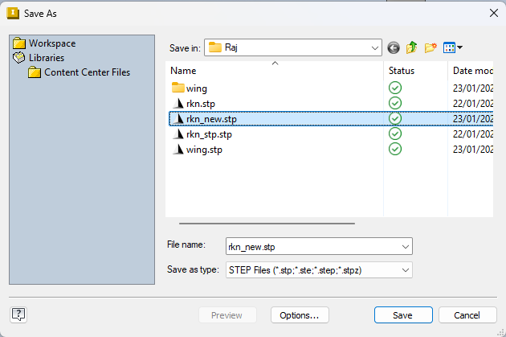

# Guide to converting a surface to a volume file

This guide explains how a surface CAD file can be converted to a volume file

## Installation of Inventor

Inventor can be used for free on an educational license. Since you have a University of Bristol email address you are able to get an educational license. Inventor can be downloaded from here [Autodesk Student Access to Education Downloads](https://www.autodesk.com/education/edu-software/overview#INVPROSA). Select **Student**, which will bring you to a form which you will need to fill in (Note that you will need to use your `bristol.ac.uk` email address. Once that is done click **submit**.

Autodesk will then send you an email to verify your acount to your `birstol.ac.uk` email address. Click on the **Complete Account Setup** button on the email. This will transfer you back to the Autodesk website. Once a password is set it will lead you the page where you can download and install Inventor.

## Convert file

I have only managed to get the following to work with `.stp` files. Since `.stl` files are mesh files this is not possible. I also have tried `.igs` files, and while it can be exported as a `.stp` file, I found that **GMSH** does not like the file for some reason. But I think with a bit of tinkering around this should also be possible. The following explains how to convert a **surface** `.stp` file to a **volume** `.stp` file.

1. Open Inventor
  
2. Open file by clicking **File** → **Open** → **Import CAD Files** 

    
  
3. Select `.stp` file (if you can't see the file, then select the **Files of type** as *STEP Files*) and click **Open**.    

     
  
4. Now you will be presented with this window

    

  Important here is that
  a) you select **Convert Model** in the **Import Type**,
  b) and only select **Surfaces** in **Object Filters** and
  c) that you select the **Stitch** option in the **Part Options** → **Surfaces**
  Once that is done click **OK**
  
5. This has now automatically converted the file into solids, and you will be presented with a window that looks something like this

    
  
6. Focusing on the object tree on the left hand side as shown in the figure below

    

  We can see the objects `Base 1` and `Base 2`. This means that this consists of `2` volumes, which will be important later when adjusting the `.geo` file.
  
7. This can now be exported as `.stp` file. Click **File** → **Export** → **CAD Format**

     

  and then you are presented with this window

     

  Click **Save**

## GMSH

Attached to this repository is a the working `.geo` GMSH file as shown below:

```
// Import 'rkn_stp.stp' file which is converted from faces to a solid. Note that the built in CAD kernel cannot pass on any
// surfaces or lines only Volumes. Hence why the conversion from surface to volume is needed and the surfaces cannot be 
// formend into a Volume in OpenCASCADE from geometries passed on from the built-in CAD kernel.
//Merge "rkn_stp.stp";
Merge "rkn_new.stp";

// Change 'Built In' kernel to 'OpenCASCADE'
SetFactory("OpenCASCADE");

// Draw box (Volume) around it the 'rkn_stp.stp' file.
Box(3) = {-500, 3100, -100, 3000, -6500, 220};

// Subtract Volume 3 form Volumes 1 and 2, and subsequently deleting Volumes 1 and 2.
BooleanDifference{ Volume{3}; }{ Volume{1}; Delete; }
BooleanDifference{ Volume{3}; }{ Volume{2}; Delete; }
```